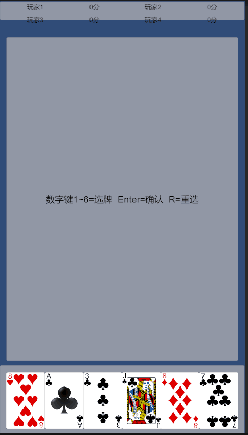
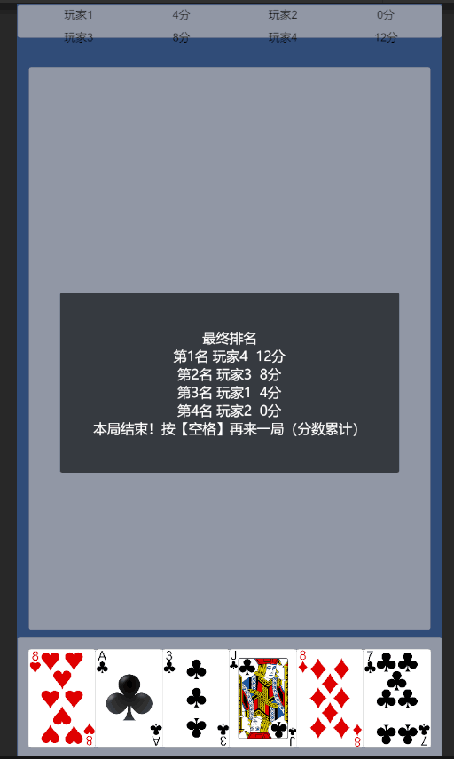

# 扑克四人对战（开发中）

四人扑克对战：每人 6 张牌拆进三关（1 张比大小 / 2 张凑十点半 / 3 张组炸金花），
逐关比牌计分。Unity 2022.x + C# + UGUI。

## 玩法截图

> 运行建议：Game 视图使用竖屏分辨率（如 1080×1920），UI 按竖屏适配。

## 技术要点
- 枚举状态机驱动对局流程（统一状态切换入口）
- Fisher-Yates 等概率洗牌
- 癞子（王）牌型穷举判定
- AI 两阶段贪心分牌
- 发牌死局预检与自动重发

## 如何运行
1. Unity Hub 打开项目（版本 2022.x）
2. 打开 Scenes/Main 场景，点 Play
